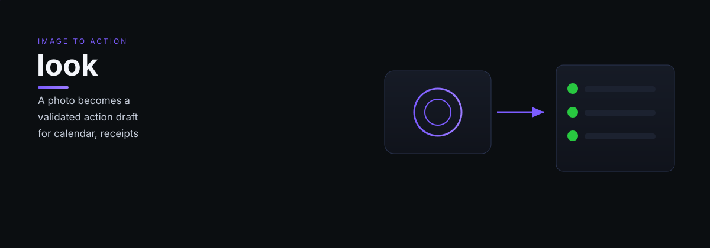

# look

look — Look: image-to-action — takes a photo and produces a validated action draft for calendar, shopping, receipts, and more.

> Tell it what you need. It does the work.

## What it does

Look takes a user-provided image, infers intent, and produces a validated action draft. It resolves ambiguity through research and option reduction before asking clarifying questions. Nothing executes without explicit per-draft confirmation. It handles receipts, documents, menus, whiteboards, products, and civic reports.

## Dependencies

- Vision API (image analysis)
- [Sift](https://github.com/indigokarasu/sift) — research for disambiguation

---

*Look is part of the [OCAS Agent Suite](https://github.com/indigokarasu).*

---

*look is part of the [OCAS Agent Suite](https://github.com/indigokarasu).*